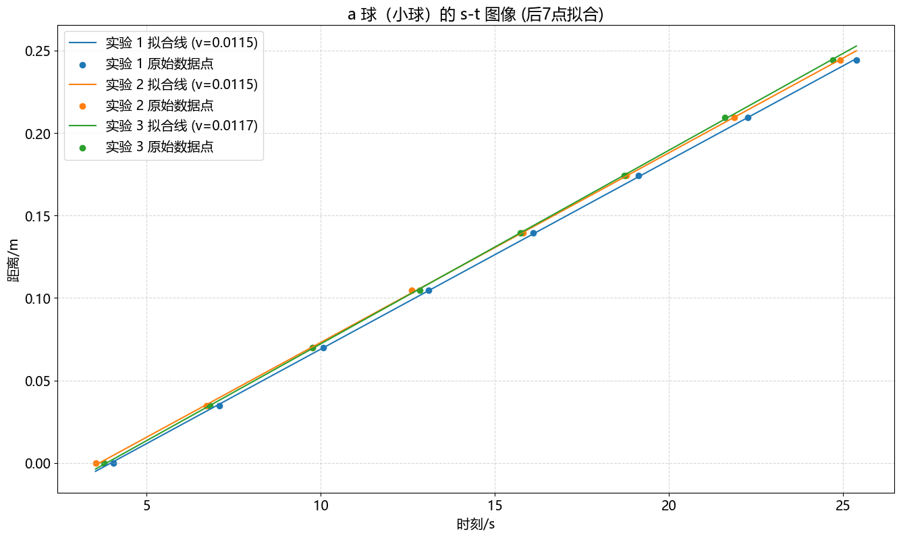
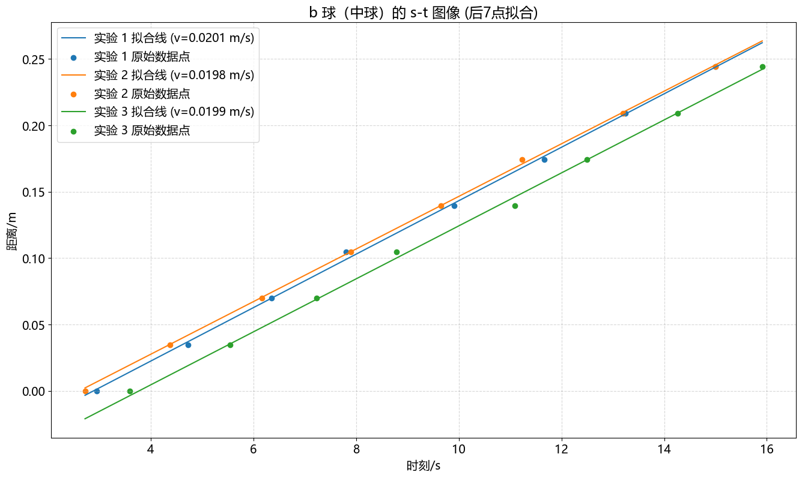
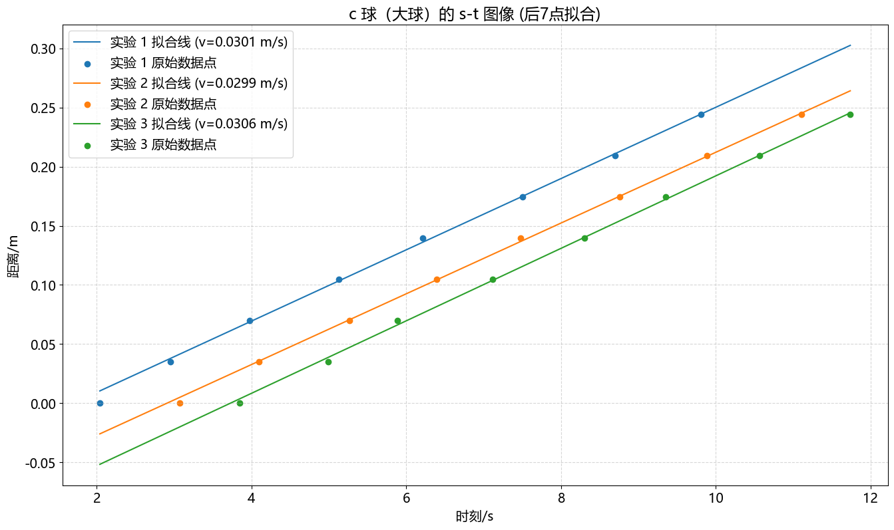

<!------>
# 
 物理实验报告 

    <strong>姓名：</strong>余佰凌 &nbsp;&nbsp; 
    <strong>学号：</strong>12510809 &nbsp;&nbsp; 
    <strong>时间：</strong>2025.03.16  下午&nbsp;&nbsp;
    <strong>实验室：</strong>P4119 
    

---

### 一. 实验名称：<u>液体黏度的测定 </u>
<!---课程名称写<u>和</u>之间--->
### 二. 实验目的 
&emsp;&emsp;学习落球法测量液体黏度的原理和方法
### 三.实验原理
#### &emsp;&emsp;1.受力分析
&emsp;&emsp;*小球在液体中下落时的合力平衡：*
$$F = G - F_b - F_d \tag{1}$$
其中：
  重力：$G = \frac{1}{6}\pi \phi^3 \rho g$ 浮力：$F_b = \frac{1}{6}\pi \phi^3 \rho_0 g$
  $\phi$,ρ,ρ0分别表示小球半径、小球密度液体密度。g表示重力加速度。
#### &emsp;&emsp;2.雷诺数及其误差修正公式
$$Re = \frac{v \rho_0 \phi}{\eta} \tag{2}$$
&emsp;(1) 当 $Re < 0.1$ 时
$$\eta_0 = \frac{1}{18} \cdot \frac{(\rho - \rho_0) g d^2}{v (1 + 2.4 \frac{d}{2R})(1 + 3.3 \frac{d}{2h})} \tag{7}$$

&emsp;(2) 当 $0.1 < Re < 0.5$ 时：
$$\eta_1 = \eta_0 - \frac{3}{16} d v \rho_0 \tag{8}$$

&emsp;(3) 当 $Re > 0.5$ 时：
$$\eta_2 = \frac{1}{2} \eta_1 \left[ 1 + \sqrt{1 + \frac{19}{270} \left( \frac{d v \rho_0}{\eta_1} \right)^2 } \right] \tag{9}$$
#### &emsp;&emsp;3.Strokes 公式
&emsp;在 $Re \ll 1$ 时，粘滞阻力 $F_d$ 为：
$$F_d = 3\pi \eta \phi v \tag{3}$$
&emsp;达到收尾速度 $v_f$ 时的平衡方程：
$$3\pi \eta \phi v_f = \frac{1}{6}\pi \phi^3 (\rho - \rho_0)g \tag{4}$$

**理想状态下的黏度计算公式：**
$$\eta = \frac{1}{18} \cdot \frac{\phi^2 (\rho - \rho_0)g}{v_f} \tag{5}$$
#### &emsp;&emsp;4.Landenburg修正公式
&emsp;考虑量筒边界影响后的公式：
$$\eta = \frac{1}{18} \cdot \frac{\phi^2 g(\rho - \rho_0)}{v_f (1 + 2.4 \phi/D)(1 + 1.7 \phi/H)} \tag{6}$$
&emsp;其中，$D$和$H$表示液柱的半径和高度。上述方程等号右边分母中的两个因子是对容器壁效应和液柱有限高效应作出的修正。
### 四.实验仪器
&emsp;1.量筒  2.蓖麻油 3.温度计 4.钢尺 5.游标卡尺 6.钢球 7.秒表 8.电子天平 9.镊子
### 五.实验内容
&emsp;1.用温度计去测量室内温度，记为$T_1$
&emsp;2.用钢尺测量液柱的高度，记录高度数据，计算平均值$\bar{H}$
&emsp;3.用游标卡尺测量液柱直径，记录直径数据，计算平均值$\bar{D}$
&emsp;4.用钢尺测量900ml刻度线和800ml刻度线的距离，计算平均值$\bar{L}$
&emsp;5.用电子天平测量30个大钢球的质量，记为$M$
&emsp;6.将钢球自油面中心附近无初速释放，用秒表依次记录钢球经过900 mm,800 𝑚𝑚，700 𝑚𝑚，600 𝑚𝑚，500 𝑚𝑚，400 𝑚𝑚，300 𝑚𝑚，200 𝑚𝑚八个刻线处的时间。作出 s−t图像，判断匀速区间并计算终止速度𝑣𝑓。重复此过程三次。 
&emsp;7.替换另外两种不同直径的小球重复步骤6。
&emsp;8.用千分尺测量三种不同直径的小球的直径，记为$\phi_A$，$\phi_B$，$\phi_C$。
&emsp;9.利用不同粒径小球的下落数据分别计算黏度。
### 六.实验数据

&emsp;见实验数据记录表

### 七.数据处理
#### &emsp;1.计算小球密度
&emsp;根据实验记录，30 颗大球的总质量 $M = 1.700 \text{ g} = 1.700 \times 10^{-3} \text{ kg}$。
大球 A 的平均直径 $\bar{\phi}_A = 2.5223 \text{ mm} = 2.5223 \times 10^{-3} \text{ m}$。

&emsp;**单个小球体积计算：**
&emsp;&emsp;$V = \frac{1}{6} \pi \bar{\phi}_A^3$$
$$V = \frac{1}{6} \times 3.14159 \times (2.5223 \times 10^{-3})^3 \approx 8.402 \times 10^{-9} \text{ m}^3$$

&emsp;**钢球密度计算：**
&emsp;&emsp;$\rho = \frac{M}{30 \times V}$
&emsp;&emsp;$\rho = \frac{1.700 \times 10^{-3}}{30 \times 8.402 \times 10^{-9}} \approx 6744.5 \text{ kg/m}^3$

#### 2.拟合小球速度
&emsp;利用 Python 对三种规格钢球（a、b、c）在下落过程中的 $s-t$ 数据进行线性拟合。为了消除初始加速阶段的影响，仅选取后 7 个刻度点进行拟合，并保留第 1 个实验点以作对比。
&emsp;a 球 (小球) s-t 图像及拟合：根据拟合斜率，得到三次实验的平均终止速度 $\bar{v}_{fa} = 0.01167\text{ m/s}$。

&emsp;b 球 (中球) s-t 图像及拟合：平均终止速度 $\bar{v}_{fb} = 0.01997\text{ m/s}$。
&emsp;c 球 (大球) s-t 图像及拟合：平均终止速度 $\bar{v}_{fc} = 0.0302 \text{ m/s}$。
#### 3. 各组小球雷诺数与黏度计算过程
&emsp;通过代入原始测量数据：$\bar{H} = 0.3356 \text{ m}$，$\bar{D} = 0.05995 \text{ m}$，深圳本地重力加速度取 $g = 9.788 \text{ m/s}^2$，钢球密度 $\rho \approx 6744.5 \text{ kg/m}^3$（由 $M=1.700\text{g}$ 算出），得到下表：

---

（1）小球 C 
&emsp;&emsp;零级黏度计算 $\eta_0$：

$$\eta_0 = \frac{0.13682}{0.18 \times 1.01167 \times 1.0616 \times 1.0151} \approx 0.7084 \text{Pa$\cdot$s}$$
&emsp;&emsp;雷诺数 $Re$：
$$Re = \frac{960 \times 0.01167 \times 0.001538}{0.7084} \approx 0.024$$
&emsp;v结论： 因 $Re < 0.1$，无需修正，最终黏度 $\eta_a = 0.7084 \text{ Pa s}$。

---

（2）中球 B 
 &emsp;&emsp;零级黏度计算 $\eta_0$：
$$\eta_0 = \frac{(6744.5 - 960) \times 9.788 \times 0.002037^2}{18 \times 0.01997 \times \left(1 + 2.4 \times \frac{0.002037}{0.05995}\right) \times \left(1 + 3.3 \times \frac{0.002037}{0.3356}\right)} \approx 0.6930 \text{ Pa s}$$
&emsp;&emsp;雷诺数判定 $Re$：
$$Re = \frac{960 \times 0.01997 \times 0.002037}{0.6930} \approx 0.056$$
&emsp;&emsp;结论： 因 $Re < 0.1$，无需修正，最终黏度 $\eta_b = 0.6930 \text{ Pa s}$。

---

（3）大球 A 
&emsp;&emsp;零级黏度计算 $\eta_0$：
$$\eta_0 = \frac{(6744.5 - 960) \times 9.788 \times 0.002522^2}{18 \times 0.0302 \times \left(1 + 2.4 \times \frac{0.002522}{0.05995}\right) \times \left(1 + 3.3 \times \frac{0.002522}{0.3356}\right)} \approx 0.6811 \text{ Pa s}$$
&emsp;&emsp;雷诺数判定 $Re$：
&emsp;&emsp;$$Re = \frac{960 \times 0.0302 \times 0.002522}{0.6811} \approx 0.107$$
 &emsp;&emsp;修正计算 $\eta_1$：
&emsp;&emsp;因 $0.1 < Re < 0.5$，代入公式：
$$\eta_c = \eta_0 - \frac{3}{16} \times \rho_0 \times v_f \times \phi$$
$$\eta_c = 0.6811 - (0.1875 \times 960 \times 0.0302 \times 0.002522) \approx 0.6674 \text{ Pa s}$$

### 八.误差分析
&emsp;1.从操作上看，测量员使用秒表过程中反应力存在误差。测量员视线未与刻度线齐平。
&emsp;2.从参数上看，实验过程中温度不断变化。测量的小球直径，液柱高度，刻线距离等也存在误差。
&emsp;3.从模型上看，这些修正公式存在误差。
&emsp;4.从实验材料，蓖麻油本身时间放置过长，密度不准，也并非理想的非牛顿流体。小球表面可能存在污渍，影响其流动过程中的速度和本身密度。小球制作出来可能不是绝对的球形。

### 九.实验结论
&emsp;在 $22.0^\circ\text{C}$ 时，测得蓖麻油的平均黏度为：
$$\bar{\eta} = \frac{0.7084 + 0.6930 + 0.6657}{3} \approx 0.689 \text{ Pa s}$$

### 十.思考题
&emsp;1.本实验为何要测量实验室温度？
&emsp;因为黏度系数随温度变化剧烈。记录温度可以一定程度上减少误差，并为实验测量的黏度系数与标准黏度系数进行对比，验证实验的严谨性。
&emsp;2.分别计算三种钢球下落的雷诺数，看其是否满足雷诺数远小于1？
&emsp;小球和中球满足远小于1.大球不满足。
&emsp;3.哪种钢球先到达终止速度？
&emsp;从实验现象看，大球先到达了终止速度。钢球刚刚进入水中的时候，重力大于总的阻力，所以加速。而大球具有最大的惯性，保持这种加速的运动状态倾向更大。所以很快到达了终止速度。
  

  