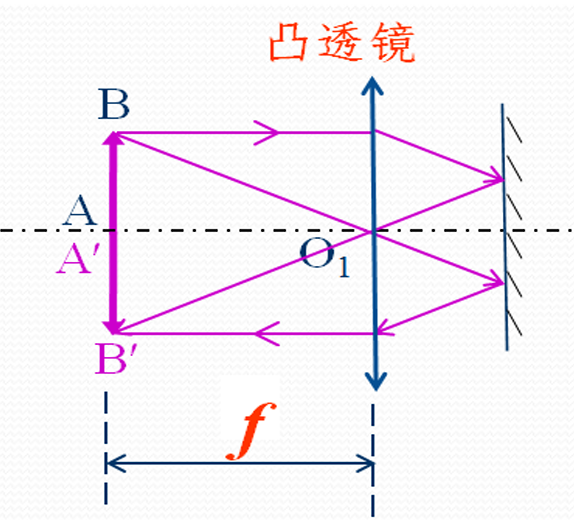
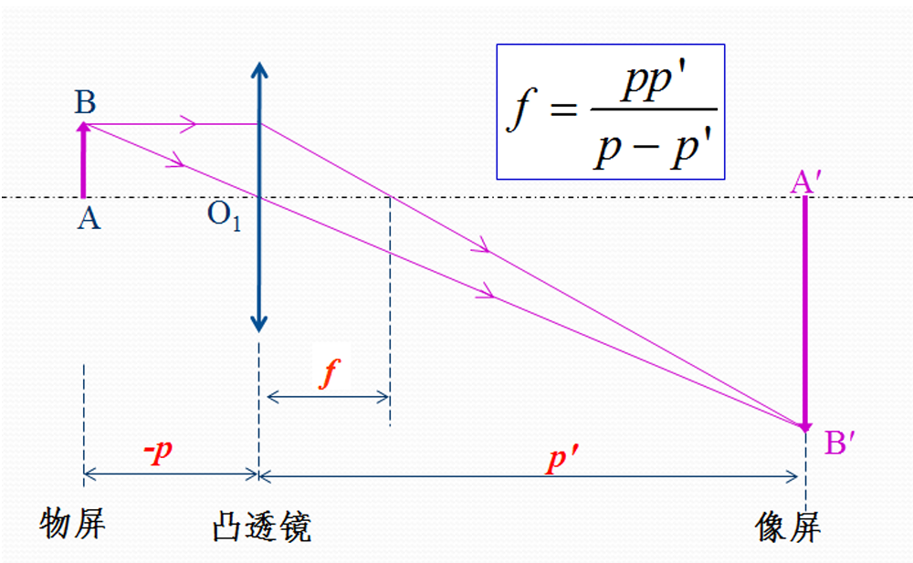
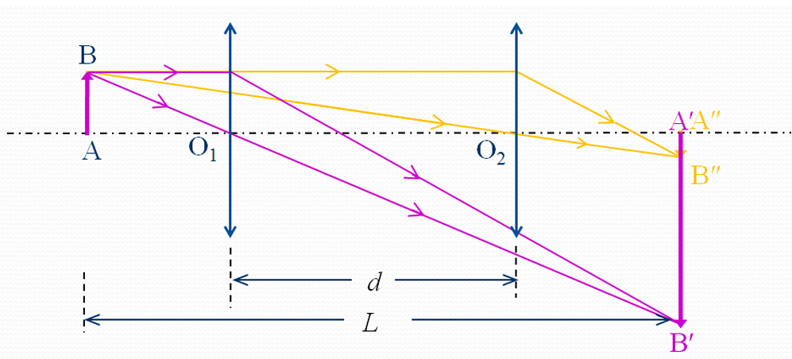
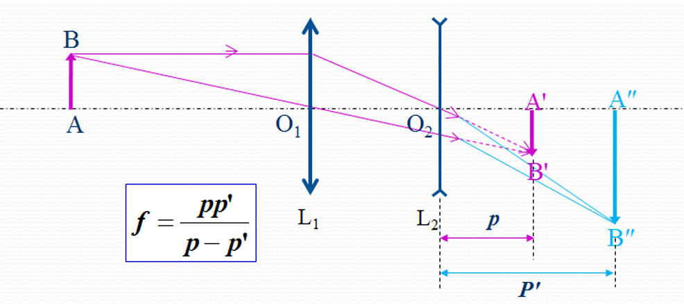

<!------>
# 
 物理实验报告 

    <strong>姓名：</strong>余佰凌 &nbsp;&nbsp; 
    <strong>学号：</strong>12510809 &nbsp;&nbsp; 
    <strong>时间：</strong>2025.03.23  下午&nbsp;&nbsp;
    <strong>实验室：</strong>P4120
    

---

### 一. 实验名称：<u>透镜参数的测量及应用</u>
<!---课程名称写<u>和</u>之间--->
### 二. 实验目的 
&emsp;1.了解光源、物、像间的关系.
&emsp;2.熟练掌握光具座上各种光学元件的共轴调节.
&emsp;3.并测量透镜的焦距。
### 三.实验原理
&emsp;1. 薄透镜成像高斯公式
在近轴光路条件下，透镜成像遵循高斯公式：
$$\frac{1}{f} =  \frac{1}{p'}-\frac{1}{p}$$
其中：$f$ 为透镜的焦距（凸透镜为正值，凹透镜为负值）。 $p$ 为物距（物体到透镜光心的距离）。 $p'$ 为像距（像点到透镜光心的距离）。
通过测量物屏位置、透镜位置和像屏位置，计算出 $p$ 和 $p'$ 即可求得焦距。

 &emsp;2.凸透镜焦距测量原理

凸透镜能够将会聚光束或平行光束汇聚成实像，测量方法包括：
(1)自准直法：将物屏置于透镜焦平面上。物屏发出的光线经透镜折射后变为平行光，经背面平面镜反射回透镜，再次折射后在物屏上成一个等大倒立的实像。此时物屏到透镜的距离 $p$ 即为焦距 $f$。
(2)公式法：调节物屏、透镜和像屏的位置，当像屏上得到清晰实像时，直接测量物距 $p$ 和像距 $p'$，代入公式 $f = \frac{pp'}{p'-p}$ 求解。
(3)位移法：固定物屏与像屏距离 $L > 4f$，在两者之间移动透镜，可以两次成清晰像。设透镜两次成像位置之间的距离为 $d$，根据公式 $f = \frac{L^2 - d^2}{4L}$ 计算焦距。

&emsp;3.凹透镜焦距测量原理

凹透镜对光线有发散作用，无法直接成实像，需利用凸透镜成的像作为物再成像：
（1）  寻找虚物：先利用辅助凸透镜使物屏成一实像，记录该像的位置 $A'$（即后续凹透镜的虚物点）。
（2） 虚物成像：在凸透镜和像点 $A'$ 之间放入待测凹透镜，此时 $A'$ 变为凹透镜的**虚物**，其物距为 $p$（通常取负值）。
   （3）测量计算：移动像屏找到凹透镜成出的新实像点 $A''$，记录其位置。测量凹透镜到虚物 $A'$ 的距离 $p$ 和到实像 $A''$ 的距离 $p'$。
（4） 代入高斯公式 $\frac{1}{f} =  \frac{1}{p'}-\frac{1}{p}$ 求得凹透镜的焦距 $f$。
### 四.实验仪器
&emsp;1.光具座  2.光源 3.凸透镜 4.凹透镜 5.平面镜 6.物屏 7.像屏
### 五.实验内容
&emsp;1.光学元件的共轴调整
(1) 粗调：将光源、物、屏、透镜放置在光具座上，并使它们尽量靠拢，用用眼睛观察，进行粗调，使各光学元件中心处在与导轨平行的同一直线上；并使物平面、透镜面和白屏面相互平行且垂直于光具座导轨。 
(2) 细调：利用两次成像法进行调节，当两次成像的中心位置完全重合，表示各光学元件已共轴。若不重合，以小像的中心位置为参考（可作一记号），调节透镜（或物），使大像中心与小像的中心完全重合。
&emsp;2.用自准直法测凸透镜焦距:
记录物屏位置$X_0$,透镜位置$X_1$
&emsp;3.用公式法法测凸透镜焦距:
记录物屏位置$X_0$,透镜位置$X_1$,像屏位置$X_2$
&emsp;4.用位移法测凸透镜焦距:
记录物屏位置$X_0$,从左往右第一个透镜位置$X_1$,第二个透镜位置$X_2$，像屏位置$X_3$
&emsp;5.测凹透镜焦距：
记录凸透镜位置，凸透镜成像位置$X_0$,凹透镜位置$X_1$,像屏位置$X_2$

### 六.实验数据

&emsp;见实验数据记录表

### 七.数据处理
 1. 自准直法测凸透镜焦距
 
 **物屏位置 $X_0$：** $17.06 \text{ cm}$
 **透镜位置 $X_1$（平均值）：** $32.217 \text{ cm}$
 **计算：**
    $$p = |X_1 - X_0| = 32.217 - 17.06 = 15.157 \text{ cm}$$
    $$f_1 = p = \mathbf{15.157 \text{ cm}}$$

 2. 公式法测凸透镜焦距

 **第一组数据：** $X_0 = 17.06, X_1 = 48.66, X_2 = 76.20$
     物距 $p = |X_1 - X_0| = 31.60 \text{ cm}$
     像距 $p' = |X_2 - X_1| = 27.54 \text{ cm}$
     $f_{2-1} = \frac{31.60 \times 27.54}{31.60 + 27.54} \approx 14.70 \text{ cm}$
 **第二组数据：** $X_0 = 17.06, X_1 = 41.267, X_2 = 79.90$
     物距 $p = |X_1 - X_0| = 24.207 \text{ cm}$
     像距 $p' = |X_2 - X_1| = 38.633 \text{ cm}$
     $f_{2-2} = \frac{24.207 \times 38.633}{24.207 + 38.633} \approx 14.89 \text{ cm}$
 **平均值：** $f_2 = \frac{14.70 + 14.89}{2} = \mathbf{14.80 \text{ cm}}$

 3. 位移法测凸透镜焦距

 **物像间距 $L$：** $X_3 - X_0 = 82.74 - 17.06 = 65.68 \text{ cm}$
 **透镜位移 $d$：** $|X_2 - X_1| = |60.150 - 39.68| = 20.47 \text{ cm}$
 **计算：**
    $$f_3 = \frac{65.68^2 - 20.47^2}{4 \times 65.68} = \frac{4313.86 - 419.02}{262.72} \approx \mathbf{14.82 \text{ cm}}$$

 4. 测凹透镜焦距

 **凸透镜成像位置（虚物点）$X_0$：** $79.917 \text{ cm}$
 **凹透镜位置 $X_1$：** $74.893 \text{ cm}$
 **最终像屏位置 $X_2$：** $95.98 \text{ cm}$
 **参数计算：**
  物距 $p = X_1 - X_0 = 74.893 - 79.917 = -5.024 \text{ cm}$
     像距 $p' = X_2 - X_1 = 95.98 - 74.893 = 21.087 \text{ cm}$
 **焦距计算：**
    $$f_4 = \frac{p \cdot p'}{p + p'} = \frac{(-5.024) \times 21.087}{(-5.024) + 21.087} \approx \mathbf{-6.60 \text{ cm}}$$
### 八.误差分析
1.从操作过程看，操作员读数时视线未与刻度前齐平，导致X值偏大或偏小。调节共轴时存在误差。
2.从实验器具上看，光学器件本身存在磨损，并不是理想的凸透镜和凹透镜。
3.从实验环境看，光源不够强，环境光相对较强，导致观察是否成像时较为粗糙。

### 九.实验结论
根据实验数据处理，得到透镜焦距测量结果如下表所示：

| 测量对象 | 测量方法 | 实验焦距 $f$ (cm) |
| :--- | :--- | :--- |
| **凸透镜** | 自准直法 | 15.157 |
| **凸透镜** | 公式法 | 14.80 |
| **凸透镜** | 位移法 | 14.82 |
| **凹透镜** | 辅助透镜法 | -6.60 |

### 十.思考题
 1. 误差来源
（1） 位移法：
    在该方法中，焦距公式为 $f = (L^2 - d^2) / 4L$。由于测量过程仅涉及透镜移动的相对位移 $d$ 和物像屏间的总距离 $L$，它完全避开了透镜光心位置不准带来的系统误差。在本次实验中，位移法所得结果（14.82 cm）应作为该透镜焦距的最优参考值。
（2）公式法：
    公式法 $f = pp' / (p + p')$ 要求精确读取透镜光心的位置以计算物距 $p$ 和像距 $p'$。若透镜支架的刻度指针未对准透镜几何中心，会引入明显的系统偏差。本次实验公式法结果（14.80 cm）与位移法接近，说明光心定位基本准确。
（3）自准直法：
    自准直法（15.157 cm）结果略高于其他方法。该方法依赖于观察物屏上反射像的清晰度。如果不清晰，很难判断哪个点是最清晰的像。同时只有一个参数，并且这个参数用肉眼观测误差大，导致误差无法抵消。

 1. 总结
数值关系：实验结果呈现 $f_{自准直} > f_{位移} \approx f_{公式}$ 的趋势。
结论：位移法通过几何关系的巧妙转换消除了大部分几何位置误差，精度最高；公式法次之，但易受单次读数波动影响；自准直法虽然操作最简便，但受限于人眼对清晰度灵敏度低以及环境影响，误差相对较大。

  

  