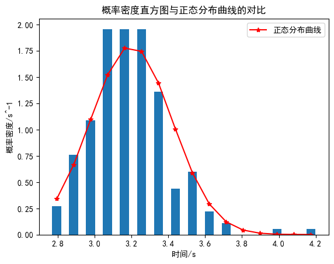

<!------>
# 
 物理实验报告 

    <strong>姓名：</strong>余佰凌 &nbsp;&nbsp; 
    <strong>学号：</strong>12510809 &nbsp;&nbsp; 
    <strong>时间：</strong>2025.03.09  下午&nbsp;&nbsp;
    <strong>实验室：</strong>P4119 
    

---

### 一. 实验名称：<u>时间测量中随机误差的分布规律</u>
<!---课程名称写<u>和</u>之间--->
### 二. 实验目的 
&emsp;1.了解随机误差的离散性和分布规律。
&emsp;2.学习直接测量量的不确定度的计算方法和表示方法。
### 三.实验原理
&emsp;1.本实验重复测量电子节拍器的周期$T_0$，测量结果为$T_1,T_2,\cdots,T_n$，其中$n$为测量次数。如果测量次数足够多，那么测量结果$T_i$的分布就会趋近于正态分布。
$$
p(T)=\frac{1}{\sqrt{2\pi}\sigma}e^{-\frac{(T-\bar{T})^2}{2\sigma^2}}
$$
&emsp;其中周期测量平均值
$$\bar{T}=\frac{1}{n}\Sigma T_i$$
&emsp;周期测量值的标准差
$$\sigma=\sqrt{\frac{\Sigma (T_i-\bar{T})^2}{n-1}}$$
&emsp;由正态分布的统计规律得
$$
P(|T-\bar{T}|<\sigma)\approx68.3\%\\
P(|T-\bar{T}|<2\sigma)\approx95.4\%\\
P(|T-\bar{T}|<3\sigma)\approx99.7\%
$$
&emsp;2.构建时间$T$的测量模型：
$$T=T_0+T_1+T_2$$
其中，$T_0$为多次测量的误差（A类），$T_1$为秒表仪器误差（B类），$T_2$为人为反应误差（B类）。
计算周期量的A类不确定度可以使用$U_A=\frac{\sigma}{\sqrt{n}}$，其中$\sigma$为测量结果的标准差，$n$为测量次数，$t_p$为置信系数。
计算周期量的B类不确定度可以使用$U_B=\frac{\sqrt{\Delta _估^2+\Delta _仪^2}}{C}*k_p$，其中$C$、$k_p$为置信系数。
标准不确定度的合成公式为：
$$u_C(T) = \sqrt{(u_A(T_0))^2 + (u_B(T_1))^2 + (u_B(T_2))^2}$$

3.节拍器周期$T_0$的测量值为$T_0=\bar{T}（u_c）$。
### 四.实验仪器
&emsp;1.电子节拍器  2.秒表
### 五.实验内容
&emsp;1.用秒表测量电子节拍器周期$T_i$，测量次数为$n=200$。
&emsp;2.计算周期量的平均值$\bar{T}$和标准差$\sigma$。
&emsp;3.根据测量结果的离散程度和极差$R=max(T_i)-min(T_i)$，设置合理步长$\Delta T$，个数为$M$。
&emsp;4.统计每个区间的频数$N_i$，计算频率$f_i=\frac{N_i}{N}$和概率密度$p_i=\frac{f_i}{\Delta T}$，绘制概率分布直方图$p-T$。
&emsp;5.计算正态分布函数$p(T)$，并绘制正态分布曲线。
&emsp;6.在$p-T$图中绘制$p(T)$正态分布的散点图，检验测量结果是否符合正态分布。
&emsp;7.分别统计在$|\bar{T}-\sigma|$、$|\bar{T}-2\sigma|$、$|\bar{T}-3\sigma|$范围内的概率，与理论值比较
&emsp;8.计算测量结果的合成不标准度，并且写出测量结果完整表达式。
### 六.实验数据

&emsp;时间统计分布规律实验数据记录表

### 七.数据处理
###### 基本统计量
&emsp;$\bar{T}=\frac{1}{n}\Sigma T_i=3.199s$，$\sigma=\sqrt{\frac{\Sigma (T_i-\bar{T})^2}{n-1}}=0.2291s$，$R=max(T_i)-min(T_i)=1.47s$
###### 概率密度直方图与正态分布曲线的对比
&emsp;将数据分为$M=16$个区间，步长$\Delta T=0.09s$，区间范围为$[2.75,4.22]$，数据处理见下表
| 区间 | 频数 | 频率 | 频率密度 | 概率密度函数值 |
| :--- | :--- | :--- | :--- | :--- |
| ( 2.75 , 2.84 ] | 5 | 0.03 | 0.27 | 0.34 |
| ( 2.84 , 2.93 ] | 14 | 0.07 | 0.76 | 0.67 |
| ( 2.93 , 3.03 ] | 20 | 0.10 | 1.09 | 1.10 |
| ( 3.03 , 3.12 ] | 36 | 0.18 | 1.96 | 1.52 |
| ( 3.12 , 3.21 ] | 36 | 0.18 | 1.96 | 1.78 |
| ( 3.21 , 3.30 ] | 36 | 0.18 | 1.96 | 1.75 |
| ( 3.30 , 3.39 ] | 25 | 0.12 | 1.36 | 1.44 |
| ( 3.39 , 3.48 ] | 8 | 0.04 | 0.44 | 1.01 |
| ( 3.48 , 3.58 ] | 11 | 0.06 | 0.60 | 0.59 |
| ( 3.58 , 3.67 ] | 4 | 0.02 | 0.22 | 0.29 |
| ( 3.67 , 3.76 ] | 2 | 0.01 | 0.11 | 0.12 |
| ( 3.76 , 3.85 ] | 0 | 0.00 | 0.00 | 0.04 |
| ( 3.85 , 3.94 ] | 0 | 0.00 | 0.00 | 0.01 |
| ( 3.94 , 4.04 ] | 1 | 0.01 | 0.05 | 0.00 |
| ( 4.04 , 4.13 ] | 0 | 0.00 | 0.00 | 0.00 |
| ( 4.13 , 4.22 ] | 1 | 0.01 | 0.05 | 0.00 |

&emsp;结果基本符合正态分布

###### 检验1$\sigma$,2$\sigma$,3$\sigma$范围内的概率
|范围|频数|实验值|理论值|
|:--:|:--:|:--:|:--:|
|$(\bar{T}-\sigma,\bar{T}+\sigma)$|$  154 $|$ 77.0\% $|$ 68.3\% $|
|$(\bar{T}-2\sigma,\bar{T}+2\sigma)$|$  193 $|$ 96.5\% $|$ 95.4\% $|
|$(\bar{T}-3\sigma,\bar{T}+3\sigma)$|$  197 $|$ 98.5\% $|$ 99.7\% $|

### 节计算不确定度

&emsp;1. 不确定度分量计算
&emsp;  A类不确定度
&emsp;  $u_A = \frac{\sigma}{\sqrt{n}} = \frac{0.231}{\sqrt{200}} \approx 0.016 \, \text{s}$
&emsp;B类不确定度 
&emsp;  $u_{B1} = \frac{0.01}{3} \approx 0.003 \, \text{s}$
&emsp;B类不确定度 
&emsp;  $u_{B2} = \frac{0.2}{3} \approx 0.067 \, \text{s}$

&emsp;2. 合成标准不确定度
&emsp;$u_C = \sqrt{u_A^2 + u_{B1}^2 + u_{B2}^2} = \sqrt{0.016^2 + 0.003^2 + 0.067^2} \approx 0.069 \, \text{s}$

&emsp;3. 测量结果表示
&emsp;$T = 3.199（69）\text{s}$

### 八.误差分析
&emsp;1.听到声音响声后再按有一定的反应时间
&emsp;2.电子节拍器本身存在误差
&emsp;3.操作员本身操作注意力不集中或操作不熟练

### 九.实验结论
&emsp;重复使用秒表测量电子节拍器的周期T,并使用统计学方法可以求得较准确的周期T。实验中随机误差大致符合正态分布，且在$|\bar{T}-\sigma|$、$|\bar{T}-2\sigma|$、$|\bar{T}-3\sigma|$范围内的概率与理论值相符。200次重复测量后，周期量的测量值为$T_0=3.199（69）\text{s}$

  

  